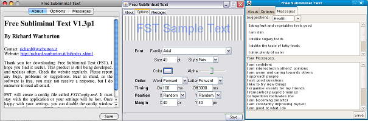

# Free Subliminal Text

## Not maintained
This project is no longer maintained. It hasn't been updated in years, so I have put the
source code online, hoping someone will bring it back to life.

[](http://www.download82.com)

## Summary
Free Subliminal Text (FST), flashes subliminal messages on screen. The default settings use very quick flashes of partially transparent text in random screen locations. Most of the time you shouldn't notice it is running, however, you can make what it does, more or less obvious. FST is still being developed so check back for updates.



## Feature List
* Completely Free - No hoops to jump through, yours forever.
* Font Control - Font family, size, style, color and transparency are all configurable.
* Text Control - Have each message's words or letters reversed or randomized.
* Placement Control - Left-Top to Right-Bottom, plus random and margin options.
* Message Control - Drag and drop suggestions are available, but any message inside Your Messages can be edited.
* Multiplatform - Windows at work, Mac and/or Linux (think Asus EEE) at home? No problem. FST runs on any platform Java (JRE 1.8+) does.

## Requirements
* Java 1.8+ must be installed.

## Setup
The application FST.jar can be put anywhere. Bear in mind that it will try to create a config file called FSTConfig.xml in the same location.
Configuration

Configuring should be straight forward using the provided config window. Closing of the window will quit FST, so you may want to minimise it when not in use. For those who like XML or want to disable the config window from appearing at start up may want to edit FSTConfig.xml directly.

## Download
* [FST1.5.jar](releases/FST1.5.jar?raw)
* [FST1.42.jar](releases/FST1.42.jar?raw)
* [FST1.41.jar](releases/FST1.41.jar?raw)
* [FST1.40.jar](releases/FST1.40.jar?raw)

## Trouble Shooting

### I can't see anything, I don't think it is working

Hopefully, it is working, but it may be too subtle for your consciousness (or screen). Click the Placement tab and change both x and y locations to "center". Try increasing the timing display. Still can't see it, increase the font alpha (up to 255).

## Notes

### Linux
If FST.jar opens in archive manager instead of executing, right-click and select "Open with Other Application", choose "Use a custom command" and type "java -jar". The window manager should remember for next time. 

## New Features drafted for future releases
* More documentation on About Tab
* Add additional built-in messages - Suggestions anyone?

## Release History
### 1.51 - 2025-07-27
* Updated to require Java 1.8.

### 1.50 - 2014-03-01
* Switched to native transparency.
* Now requires Java 1.6.
* Now only saves config on clean exit.
* Fix - message order no longer lost between loads.

### 1.42 - 2013-04-19
* Fix divide by zero error.
* Initial "Test Message" added for first time users.

### 1.41 - 2011-09-01
* Add message order option.
* Fixed user save directory.

### 1.40
* Added minimize on startup option.
* Removed save button - now autosaves.
* Interface tweaks
* Check for updates option - check every 30 days after install.
* Friendly window close dialog with minimize option.
* Fixed paste in message window.
* Now saves valid XML when messages contain special characters.

### 1.3p1
* Added Word and Letter Order options.
* Simplified GUI with a single tab for all options.
* Replaced quit button with enabling window close and adding quit dialog.
* First version uploaded to download sites

### 1.2
* Added GUI

### 1.01
* Bugfix?: Memory Leak? - Now Flushes image data after each flash so we don't keep using up ram whilst waiting for garbage collection.

### 1.0
* 5kb GUI-less program, simply displayed text from xml file.

## Development

This section provides information for developers who want to build, test, and contribute to the FST project.

### Development Setup

#### Required Software
- JDK 8 or higher
- Apache Ant 1.9 or higher
- Git (optional, for version control)

#### IDE Support
The project is set up to work with NetBeans, but can be imported into any Java IDE that supports Ant projects:
- NetBeans: Open the project directly
- Eclipse: Import as Ant project
- IntelliJ IDEA: Import as Ant project

#### Initial Project Setup
1. Clone or download the repository
2. Open a terminal in the project directory
3. Run `ant resolve` to download dependencies

### Build Process

FST uses Apache Ant with Ivy for dependency management. The build system handles compilation, testing, and packaging of the application.

#### Directory Structure
```
fst/
├── src/                  # Source code
├── test/                 # Test code
│   ├── java/             # Test classes
│   └── resources/        # Test resources
├── lib/                  # Ivy-managed dependencies
├── build/                # Compiled classes
├── dist/                 # Distribution files
├── reports/              # Test and coverage reports
├── ivy/                  # Ivy installation
├── ivy.xml               # Dependency definitions
└── build.xml             # Ant build script
```

### Build Targets

The following Ant targets are available:

#### Core Build Targets
- `ant clean` - Removes all build artifacts
- `ant compile` - Compiles the source code
- `ant jar` - Creates the executable JAR file
- `ant run` - Runs the application
- `ant javadoc` - Generates JavaDoc documentation

#### Dependency Management
- `ant resolve` - Downloads dependencies using Ivy
- `ant report` - Generates a dependency report
- `ant clean-ivy` - Removes downloaded dependencies

#### Testing
- `ant compile-test` - Compiles test classes
- `ant test` - Runs unit tests
- `ant coverage` - Runs tests with code coverage analysis

#### Complete Build
- `ant clean build` - Performs a clean build
- `ant clean build test` - Performs a clean build and runs tests

### Testing

The project uses JUnit 5 for testing, with AssertJ for assertions and Mockito for mocking.

#### Test Structure
- Unit tests are located in `test/java/`
- Test resources are in `test/resources/`
- Tests follow the standard naming convention: `*Test.java`

#### Running Tests
- From command line: `ant test`
- From IDE: Run the test classes directly

#### Code Coverage
Code coverage reports are generated using JaCoCo:
1. Run `ant coverage`
2. Open `reports/coverage/html/index.html` in a browser

### Creating Releases

To create a release build:

1. Update version number in `src/FST.java`
2. Update the README.md with release notes
3. Run `ant clean jar`
4. The release JAR will be in the `dist/` directory

### Setting Up Continuous Integration

Continuous Integration (CI) is not currently set up for this project, but can be added using one of the following services:

#### GitHub Actions (Recommended)
To set up GitHub Actions:
1. Create a `.github/workflows` directory in the project root
2. Add a workflow file (e.g., `build.yml`) with the following content:
   ```yaml
   name: Java CI with Ant

   on:
     push:
       branches: [ main ]
     pull_request:
       branches: [ main ]

   jobs:
     build:
       runs-on: ubuntu-latest
       steps:
       - uses: actions/checkout@v3
       - name: Set up JDK 8
         uses: actions/setup-java@v3
         with:
           java-version: '8'
           distribution: 'temurin'
       - name: Build with Ant
         run: ant -noinput -buildfile build.xml resolve test
       - name: Generate coverage report
         run: ant -noinput -buildfile build.xml coverage
       - name: Archive test results
         uses: actions/upload-artifact@v3
         with:
           name: test-results
           path: build/test/results
       - name: Archive coverage report
         uses: actions/upload-artifact@v3
         with:
           name: coverage-report
           path: reports/coverage
   ```

#### Jenkins
For a self-hosted Jenkins setup:
1. Install Jenkins on your server
2. Create a new Jenkins job for the project
3. Configure it to use the Ant build script
4. Set up build triggers (e.g., poll SCM)
5. Add build steps to run `ant resolve test coverage`
6. Configure post-build actions to publish test results and coverage reports

#### Travis CI
To use Travis CI:
1. Create a `.travis.yml` file in the project root:
   ```yaml
   language: java
   jdk:
     - openjdk8
   before_install:
     - chmod +x build.xml
   script:
     - ant resolve test coverage
   ```
2. Connect your repository to Travis CI

### Troubleshooting Development Issues

#### Common Issues
- **Ivy resolution fails**: Check network connection and proxy settings
- **Tests fail**: Check the test reports in `build/test/results/`
- **Build fails**: Check the console output for specific error messages

#### Getting Help
If you encounter issues or have questions about the development process, please open an issue on the project repository.
